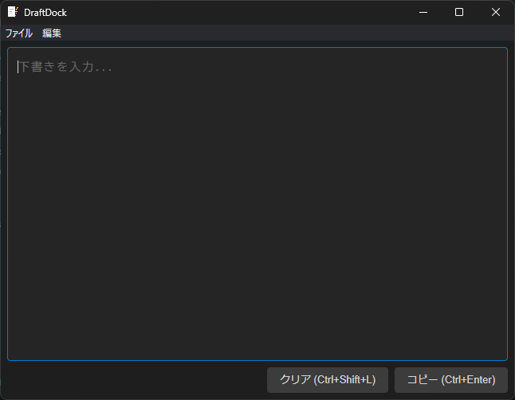
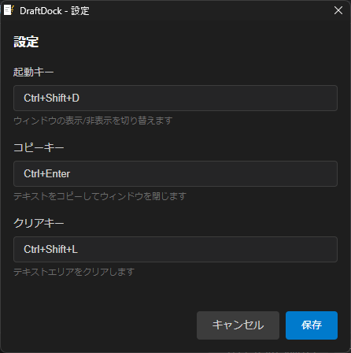

# DraftDock

A resident draft application to prevent accidental sends in AI/chat tools.

## Supported OS

- Windows (x64)
- macOS (Intel / Apple Silicon)

## Download

Download from [Releases](https://github.com/shimasan0x00/DraftDock/releases).

| OS | File |
|----|------|
| Windows | `.exe` (NSIS installer) |
| macOS | `.dmg` or `.zip` |

## Overview

<p align="center">
  
</p>

- **Instant access via hotkey** - Press `Ctrl/Cmd+Shift+D` to show the draft window from any application
- **One-action copy** - `Ctrl/Cmd+Enter` copies to clipboard and closes the window
- **One-action clear** - `Ctrl/Cmd+Shift+L` clears the draft
- **Drafts persist** - Drafts are restored even after closing the window or restarting the app

<p align="center">
  
</p>

## Features

| Feature | Description |
|---------|-------------|
| Tray resident | Stays in the system tray, always ready to be called |
| Hotkey | Customizable activation key and copy key |
| Persistence | Automatically saves drafts and window position |
| Always on top | Always displayed in front of other windows |

## Default Keyboard Shortcuts

| Action | Key |
|--------|-----|
| Show/Hide | `Ctrl/Cmd+Shift+D` |
| Copy & Close | `Ctrl/Cmd+Enter` |
| Clear | `Ctrl/Cmd+Shift+L` |
| Close | `Escape` |

> **Note**: On macOS, `Cmd` is used instead of `Ctrl`. You can customize all hotkeys from the settings screen.

All hotkeys can be customized from the settings screen (tray icon → Settings).

## Installation

### macOS

DraftDock uses ad-hoc signing, so Gatekeeper may show a warning on first launch. You can bypass it with the following command:

```bash
xattr -cr /Applications/DraftDock.app
```

### Windows Setup

See [docs/windows-setup-guide.md](docs/windows-setup-guide.md) for details.

## Development

```bash
# Clone the repository
git clone https://github.com/shimasan0x00/DraftDock.git
cd DraftDock

# Install dependencies
npm install

# Build & launch
npm start
```

### Git Hooks Setup

```bash
chmod +x ./scripts/setup-githooks.sh
./scripts/setup-githooks.sh
```

### Commands

| Command | Description |
|---------|-------------|
| `npm run build` | Compile TypeScript |
| `npm start` | Build & launch the app |
| `npm test` | Run all tests (unit + E2E) |
| `npm run test:unit` | Unit tests (Vitest) |
| `npm run test:e2e` | E2E tests (Playwright) |
| `npm run pack` | Package (directory) |
| `npm run dist` | Create installer |

### Directory Structure

```
src/
├── main/              # Main process
│   ├── main.ts        # Entry point
│   ├── tray.ts        # Tray management
│   ├── hotkey.ts      # Global hotkey
│   ├── window.ts      # Window management
│   ├── store.ts       # Persistence
│   ├── menu.ts        # Application menu
│   ├── validators.ts  # Input validation
│   └── __tests__/     # Unit tests
├── shared/
│   ├── ipc-channels.ts # IPC channel constants
│   └── types.ts       # Shared type definitions
├── preload/
│   └── preload.ts     # contextBridge API
└── renderer/
    ├── index.html     # Main window
    ├── index.css
    ├── index.ts
    ├── settings.html  # Settings window
    ├── settings.css
    ├── settings.ts
    └── types.d.ts     # Type definitions
e2e/                   # E2E tests (Playwright)
assets/
├── fonts/             # Bizin Gothic (Japanese monospace font)
└── *.ico, *.png       # Icons
```

### Data Storage

```
# Windows
%APPDATA%\DraftDock\
├── settings.json   # Settings (hotkeys, window position)
└── draft.json      # Draft

# macOS
~/Library/Application Support/DraftDock/
├── settings.json   # Settings (hotkeys, window position)
└── draft.json      # Draft
```

## Tech Stack

- **Electron** - Cross-platform desktop application
- **TypeScript** - Type-safe development
- **electron-store** - Settings and data persistence

## Documentation

- [Specification](plan/spec.md)
- [Windows Setup & Verification Guide](docs/windows-setup-guide.md)

## License

MIT
